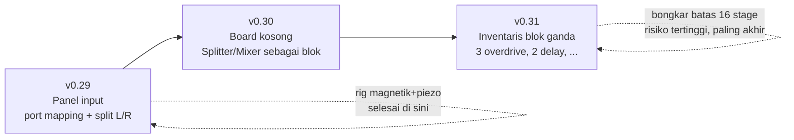
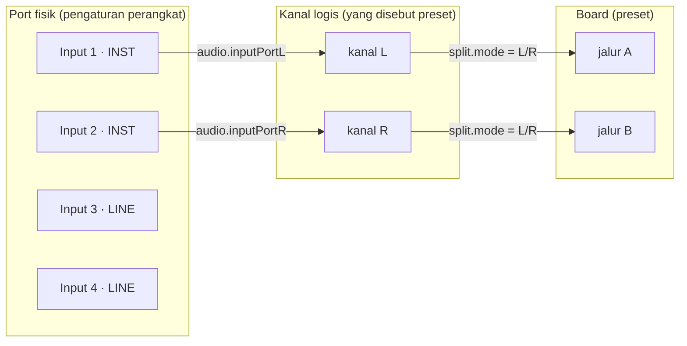
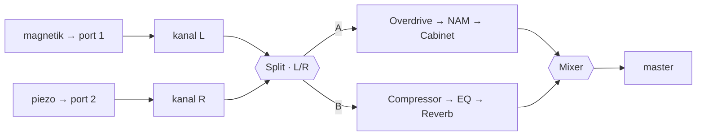
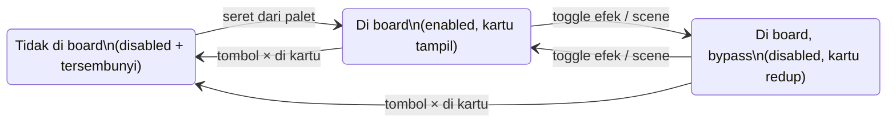
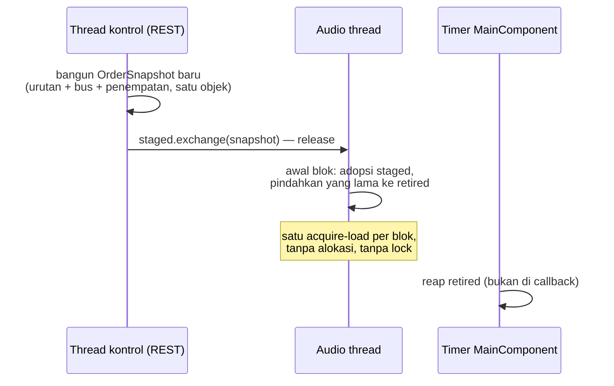

# P11–P13 — Panel input, board kosong, dan blok ganda

*Direncanakan 31 Jul 2026, dari diskusi panjang yang memvalidasi dua sumber utama: Logic Pro
Pedalboard (Router, Splitter/Mixer otomatis) dan Fractal FM9 (blok Input, inventaris blok tetap,
rig magnetik+piezo). Prototipe interaktifnya bisa dicoba di
<https://claude.ai/code/artifact/62bb34ac-fd11-423c-9ef6-16ef0e4c7603>; alur UX-nya di
[`pedalboard-ux.md`](pedalboard-ux.md).*

Tiga rilis, masing-masing berdiri sendiri dan bisa berhenti kapan pun tanpa ada yang setengah
jadi — pola yang sama dengan v0.25→v0.28:



Urutannya disengaja: yang paling kecil dan paling langsung berguna (rig dua-pickup) duluan; yang
menyentuh jantung audio thread (repack urutan) paling akhir, saat dua rilis sebelumnya sudah
membuktikan bentuk UX-nya benar.

---

## v0.29.0 — "Panel input" (P11) — **SELESAI (31 Jul 2026)**

> **Terkirim sesuai rencana, dengan satu temuan yang layak dicatat.**
>
> Lubangnya lebih besar dari dugaan: `initialise(2, 2, ...)` membuat 4i4 hanya pernah membuka dua
> channel. Setelah dibuka lebar, perangkat yang sama melaporkan **enam** — Input 1–4 plus dua
> channel loopback. Jadi ini bukan penyempurnaan, ini memang lubang.
>
> **Test L/R saya lolos karena alasan yang salah, dan itu ketahuan sebelum rilis.** Versi pertama
> mem-pan kedua jalur ke sisi berlawanan lalu memeriksa tiap kanal output — dan angka itu **identik**
> di mode `even`, karena kiri-jalur-A dan kanan-jalur-B membawa sampel yang sama di kedua mode.
> Diperbaiki dengan membiarkan kedua jalur di tengah dan menambah assertion bahwa `even` mendarat di
> angka lain. Dibuktikan dengan sengaja merusak routing-nya: 0.6 lawan 0.24, tiga assertion gagal.
> Ini kelas kesalahan yang sama dengan bug stereo NAM — test yang tidak bisa gagal lebih buruk
> daripada tidak ada test, karena ia terbaca sebagai bukti.
>
> Satu perubahan yang perlu disebut terang-terangan: **rentang `split.mode` tumbuh dari 0..1 jadi
> 0..2.** Preset dan settings menyimpan nilai polos jadi tidak terpengaruh, tapi otomasi host VST3
> menyimpan nilai ternormalisasi — sebuah lajur otomasi lama yang menulis 1.0 (dulu `crossover`)
> sekarang mendarat di `leftRight`. Split baru ada sejak v0.28, jadi dampaknya nyaris nol, tapi
> harganya dibayar sadar, bukan tidak sengaja.

## v0.29.0 — rencana awal (P11)

**Tujuan:** gitar dengan dua output jack — magnetik + piezo — masuk ke Scarlett port 1 dan 2,
menjadi dua chain penuh dengan kenop masing-masing, digabung di Mixer. Ditambah: memilih port
fisik untuk tiap kanal, karena hari ini engine hanya pernah melihat dua channel pertama yang
kebetulan diserahkan JUCE.

### Model tiga lapis

Adaptasi blok Input FM9, dipotong di tempat yang benar. FM9 boleh menulis "Input 2" di preset
karena semua FM9 punya panel belakang yang sama; kita jalan di interface sembarang, jadi ada satu
lapisan pemetaan:



**Preset menyebut L/R, perangkat memetakan port.** Preset "Ambient Lead" tetap bermakna di
interface lain; "gitar di port 3" tidak. Mode blok Input FM9 (Left Only / Right Only / Sum L+R /
Stereo) sudah kita punya persis sebagai `input.mode` — tidak berubah.

### P11-1. Engine: buka semua port + pemetaan

`AudioDeviceController` hari ini membuka `initialise(2, 2, ...)` — di 4i4, port 3/4 secara
harfiah tidak bisa dijangkau. Diubah: buka semua channel input device (praktisnya ≤8), lalu
petakan dua port pilihan ke kanal L/R engine di titik `MainComponent` menyalin
`inputChannelData`.

**Jebakan yang menentukan implementasi:** JUCE menyerahkan `inputChannelData` **berdasarkan
urutan channel aktif, bukan nomor port fisik**. Kalau yang aktif port 2 dan 4, `in[0]` = port 2.
Lapisan pemetaan harus menerjemahkan *port fisik → posisi di antara channel aktif*, dihitung
ulang **setiap device berubah** — bukan sekali di startup. Salah di sini gejalanya bukan crash,
tapi sunyi atau sinyal dari port yang salah.

- Persist: `audio.inputPortL` / `audio.inputPortR` di settings file (bukan preset), disimpan
  sebagai **nama channel** (dari `getInputChannelNames()`; ASIO memberi nama sungguhan), resolve
  ke indeks saat device dibuka. Nama tak ditemukan → fallback dua channel pertama, dicatat di log.
- Meter input tidak berubah: ia mengetuk *setelah* pemetaan, aritmetika `inputDb + trimDb` tetap
  benar.

### P11-2. DSP: mode Splitter `L/R` + polaritas Mixer

`SplitProcessor::Mode` bertambah satu nilai: `leftRight`. Semantiknya semantik "Left Only" FM9,
diduplikasi mono ke tiap jalur:

```
divide():  pathA[0] = pathA[1] = in[0]      // kanal L, mono ke jalur A
           pathB[0] = pathB[1] = in[1]      // kanal R, mono ke jalur B
```

Mono-duplikat, bukan satu sisi kosong — supaya stage dual-mono di hilir memproses sinyal di
tengah, dan pan di Mixer yang menempatkannya di bidang stereo.



- Mode L/R hanya bermakna saat `input.mode = stereo`. **Tidak dikopel di engine** (parameternya
  ortogonal dan keduanya sah sendiri-sendiri); UI menampilkan chip peringatan saat `split.mode =
  L/R` tapi input mode bukan stereo.
- **`mixer.invertB`** (bool): flip polaritas jalur B. Piezo + magnetik bisa saling membatalkan
  sebagian saat diblend — bukan soal delay (keduanya lewat konverter yang sama, tiba di sampel
  yang sama), murni polaritas transducer. Satu parameter, langsung melayani rig utamanya.
- Test: sinyal hanya-kiri keluar utuh di A dan nol di B (dan sebaliknya, simetris); L/R dengan
  konten identik L=R ≡ mode `even` bit-exact; `invertB` dua kali ≡ tanpa invert.

### P11-3. API + UI

- `/api/devices` membawa daftar port input (nama asli) + pemetaan aktif; `PUT` untuk mengubah.
  Panel Device dapat dua dropdown: *Kanal L ← port*, *Kanal R ← port*.
- `split.mode` bertambah opsi ketiga di kartu Split; router ChainStrip memberi label sumber per
  jalur saat mode L/R (`A ← Input 1 · INST`) — di situ router berhenti jadi hiasan dan mulai jadi
  diagram kabel.
- **Plugin:** panel port disembunyikan (`isPluginHost()` — host yang punya I/O). Mode L/R tetap
  bekerja atas stereo yang host serahkan; didokumentasikan di kartu Split.

### Definition of done v0.29 — tercapai

**1.820.585 assertion backend** (SplitTests +4, InputRoutingTests baru dengan 8 kasus pemetaan
port), **229 test frontend** (DeviceSettings +6, EffectRack split modes +3), type-check, lint,
**E2E 54/54**, smoke, **pluginval strictness 10 exit 0**, CLAUDE.md + README + landing page,
rilis + installer. Diverifikasi terhadap Scarlett 4i4 sungguhan: enam port terbaca, round-trip
pemetaan benar, nama port asing jatuh ke fallback dan tercatat di log, pilihan bertahan setelah
restart.

---

## v0.30.0 — "Board kosong" (P12) — **SELESAI (1 Agu 2026)**

> **Terkirim, dengan dua koreksi yang datang dari mencoba menjalankannya.**
>
> **"Board kosong" ternyata tidak pernah berarti nol.** Input dan Master pinned, jadi rack selalu
> berisi keduanya dan pemeriksaan `length === 0` tidak pernah menyala. Kondisinya diganti jadi
> *tidak ada blok yang bisa dibuang sedang terpasang*. Chain strip pun tetap menampilkan Master —
> dan itu jujur, bukan cacat: Master memang ada di jalur.
>
> **Palet yang tumbuh bebas mengubur panel device.** Sidebar-nya `overflow-y: auto`, jadi palet
> mendorong panel Audio Device keluar dari area yang terlihat — dan sejauh apa tergantung berapa
> blok yang kebetulan belum dipasang, yang berarti panel di bawahnya bergeser karena alasan yang
> tidak dipilih siapa pun. Muncul sebagai **kegagalan E2E di dua dari empat run**, yang terbaca
> seperti flake dan bukan. Palet sekarang punya tinggi terbatas dan scroll di dalam dirinya
> sendiri; tiga run E2E berturut-turut bersih setelahnya.
>
> Aturan migrasi ditegakkan dengan test dan diverifikasi terhadap engine hidup: preset yang ditulis
> tanpa `chainBoard` dimuat sebagai **board penuh**. Membacanya sebagai board kosong akan
> mengosongkan rig setiap orang secara diam-diam, dan itu satu-satunya kesalahan di rilis ini yang
> tidak akan terlihat sampai terlambat.

## v0.30.0 — rencana awal (P12)

**Tujuan:** board mulai kosong = kabel lurus (shunt-nya Fractal); user menyusun rig dengan drag
& drop dari palet; Splitter dan Mixer adalah blok yang ditaruh, bukan mode yang dinyalakan.
Perilakunya sudah teruji di prototipe (26 pemeriksaan headless); rilis ini memindahkannya ke
aplikasi.

### Model penempatan

Prosesor **tetap semua dibangun** saat startup (registry tidak berubah, daftar parameter VST3
tetap). "Ditaruh di board" adalah status, bukan keberadaan:



- **Invarian engine:** tidak di board ⇒ disabled, ditegakkan di satu tempat (handler), bukan
  dipercayakan ke UI.
- **Aturan scene tidak berubah:** scene menyimpan enable flags dan hanya berlaku pada stage yang
  *di board*; penempatan itu milik **preset**, bukan scene — persis FM9 (layout grid per preset,
  scene mem-bypass). Scene yang menata ulang board mid-lagu adalah kejutan yang aturan scene
  larang.
- **Migrasi:** preset schema ≤7 dan settings lama → **semua stage di board** (bunyi tidak berubah
  sesudah update — tidak bisa ditawar). "Board kosong" adalah default aksi *Board baru*, bukan
  default migrasi.

### P12-1. Engine + API

`placed` sebagai himpunan id di samping order (satu snapshot dengan order dan bus — lihat P13-1;
di v0.30 masih muat di mekanisme sekarang). `/api/chain/order` (GET) membawa `placed`;
`PUT /api/chain/board {placed: [ids]}` mengubahnya. Schema preset **8**: `board` tersimpan di
preset dan settings. `applyIds` tetap pemaaf dua arah — id tak dikenal diabaikan, stage yang tak
disebut kembali ke posisi build.

### P12-2. UI: palet + lajur + router

Dari prototipe, dipindah ke React dengan disiplin yang sudah ada (`useChainReorder`, pointer
events, bukan HTML5 DnD):

- **Palet** di sisi kanan, blok dikelompokkan (Dinamika / Drive / Nada / Amp / Ruang / Utilitas);
  seret ke lajur = taruh. Enter/Space menaruh ke ujung jalur A (jalan tanpa pointer).
- **Splitter dari palet membuka jalur B; Mixer menyusul sendiri** di ujung kanan dan ikut hilang
  saat Splitter dibuang (kutipan Apple: *"a Mixer automatically appears at the far right"*).
  Jalan pintas kedua: menjatuhkan blok langsung ke lajur B memasangkan Splitter+Mixer otomatis.
- **Dua aturan letak Logic ditegakkan dengan koreksi, bukan penolakan:** Mixer tidak boleh
  mendahului Splitter-nya (dilipat ke ujung), Splitter tidak boleh jadi blok terakhir (ditarik
  mundur satu). Seretan yang diam-diam mental balik terbaca seperti seretan yang rusak.
- **ChainStrip jadi router dua garis** di antara Splitter dan Mixer — garis **atas B, bawah A**
  (konvensi Apple: A lurus terus, B memutar di atasnya); satu garis di luar seksi paralel.
- Kartu Splitter/Mixer bergaya utilitas (garis putus, warna bus, tanpa nomor instance).

### Definition of done v0.30 — tercapai

**1.821.370 assertion backend** (BoardTests baru: 9 kasus, termasuk *off the board is bit-identical
to a chain built without it*), **248 test frontend** (BoardPalette +7, ChainStrip router +6,
useChainReorder palette +3, EffectRack removal +3), type-check, lint, **E2E 54/54 tiga kali
berturut-turut**, smoke, **pluginval strictness 10 exit 0**, plus **18 probe terhadap engine hidup**
— termasuk preset tanpa `chainBoard` yang dimuat sebagai board penuh. Dokumentasi + dua screenshot
+ landing page.

---

## v0.31.0 — "Inventaris blok ganda" (P13) — **SELESAI (1 Agu 2026)**

> **Terkirim, dan pengukurannya mengubah satu keputusan sekaligus mengonfirmasi sisanya.**
>
> Diukur lebih dulu seperti yang rencana ini tuntut: di 96 kHz sebuah delay ±1,5 MB, cabinet
> ±1,2 MB, reverb ±1 MB. Inventaris membawa satu rantai dari **3,8 MB ke 7,7 MB** — jatahnya aman
> dan angka-angkanya sekarang tercatat di `tests/InventoryTests.cpp`, bukan di kepala seseorang.
>
> **Batas 16 stage benar-benar hilang.** Packing 4-bit diganti satu `Snapshot` yang ditulis di bawah
> spin lock dan disalin audio thread di bawah **try-lock** — tidak pernah memblokir, tidak pernah
> mengalokasi, dan kalau lock-nya sedang dipegang ia cukup memakai salinan yang sudah ada satu blok
> lagi. Ini juga menutup celah nyata: urutan, bus, dan penempatan dulu tiga atomic terpisah.
>
> **Dua tempat hanya menjangkau instance 1 dan harus dibuat sengaja**: `global.bpm` sekarang menulis
> ke *setiap* delay (satu tempo untuk seluruh aplikasi adalah aturannya, dan delay kedua yang
> tertinggal akan hanyut terhadap klik), dan latensi yang dilaporkan plugin menjumlahkan *semua*
> overdrive — di host tidak ada board untuk mencopot satu, jadi ketiganya berjalan.
>
> **Di frontend, semua tabel yang di-key oleh id diam-diam rusak** untuk instance kedua: warna
> aksen, label enum, tata letak kontrol drive, pita kurva nada. Semuanya sekarang di-key oleh
> *tipe*, lewat satu helper. Ini kelas bug yang tidak menimbulkan error — ia hanya kehilangan
> semuanya, diam-diam.
>
> Satu temuan dari harness, bukan dari produk: **suite E2E tidak pernah mengisolasi berkas
> settings**, jadi ia menilai board dan urutan yang ditinggalkan sesi sebelumnya — itulah sebabnya
> ia melaporkan satu kegagalan di satu run dan tiga di run berikutnya. Sekarang berkasnya disisihkan
> selama run, persis seperti `smoke.ps1` sejak dulu.

## v0.31.0 — rencana awal (P13)

**Tujuan:** dua overdrive seri di satu jalur; overdrive di A *dan* B dengan kenop terpisah —
cara FM9 (2 Amp, 3 Drive, 4 Delay), bukan registry dinamis. Semua instance dibangun saat
startup dan menunggu di palet; registry tetap immutable, daftar parameter VST3 tetap tetap.

### Inventaris

| Tipe | Jumlah | Alasan batas |
|---|---|---|
| Overdrive | **3** | tumpuk seri (screamer → fuzz) + satu di jalur lain |
| NoiseGate, CleanBoost, Compressor, EQ, Contour, Cabinet, Delay, Reverb | **2** | satu per jalur |
| **NAM** | **1** | satu model Standard ≈ 29% budget CPU di 96 kHz/32 sampel — bukan batas format |
| Input, Split, Mixer, Master | 1 | pinned / utilitas |

Total **24 stage** (sekarang 14), ±133 parameter (sekarang 70). Angka jatah adalah tuas, bukan
arsitektur — tapi lihat *Prasyarat pengukuran* di bawah sebelum menguncinya.

### Skema id: instance 1 tidak berganti nama

**`overdrive` tetap `overdrive`; yang baru adalah `overdrive2`, `overdrive3`.** Ini keputusan
paling penting di P13, karena menghapus hampir seluruh masalah migrasi:

- Preset, settings, MIDI mapping, modifier, pin, dan channel lama semua merujuk id polos — dan id
  itu **masih ada**. Tidak ada tabel migrasi.
- Parameter VST3 bertambah **append-only** — lajur otomasi yang sudah ada di proyek DAW lama
  tidak bergeser. (`Overdrive 2 Drive` terbaca di DAW, bukan `Slot 7 Param 3` — inilah alasan
  memilih inventaris tetap ketimbang slot generik.)
- Aturan baca satu baris: id tanpa angka = instance 1. Label UI menomori hanya bila tipe itu
  bisa ganda, jadi board yang memakai satu-satu terbaca persis seperti sekarang.

### P13-1. Engine: snapshot urutan menggantikan packing 4-bit

Urutan hari ini dikemas 4 bit per stage ke satu `atomic<uint64_t>` — muat 16, dan 24×4 = 96 bit
tidak muat. Diganti **snapshot yang dipublikasikan lewat pointer** — pola yang sama dengan Slot
NAM, yang sudah terbukti di codebase ini:



Bonus yang bukan basa-basi: urutan, bus, **dan penempatan** hidup di **satu objek** — hari ini
urutan dan bus adalah dua atomic terpisah, jadi secara teori satu blok bisa melihat urutan baru
dengan bus lama. Snapshot menutup celah itu sekalian.

### P13-2. Instance + pengawatan

- `ChainFactory` membangun dari tabel inventaris; `ChainOrder` memuat id ber-instance.
- `findProcessor<T>()` = "instance pertama" — semua pemakaian di-audit; yang harus menyentuh
  *semua* instance diganti eksplisit. Yang sudah ketahuan: **`global.bpm` harus mendorong tempo
  ke kedua delay**, bukan cuma yang pertama.
- `DRIVE_CONTROLS` di EffectRack di-key lewat tipe (strip angka), bukan id mentah.
- Palet menampilkan **sisa jatah** (`2/3`), habis = redup — ditolak sebelum gestur dimulai.

### Prasyarat pengukuran (sebelum jatah dikunci)

1. **Memori:** tiap instance itu objek DSP sungguhan — dua Cabinet = empat mesin konvolusi, dua
   Delay = dua delay line penuh. Ukur RSS sebelum/sesudah, catat angkanya di dokumen ini.
2. **CPU:** PerformanceTests dapat kasus terburuk baru (semua instance di board, voicing
   termahal); assertion rasio yang build-independent, seperti biasa.

### Definition of done v0.31 — tercapai

**1.821.761 assertion backend** (InventoryTests baru: 6 kasus inventaris + 2 pengukuran;
BoardTests +2 untuk rantai >16 stage dan konsistensi snapshot), **252 test frontend**
(BoardPalette +4), type-check, lint, **E2E 54/54** (6 dari 7 run bersih; satu kegagalan pada test
yang sudah punya riwayat flake sebelum rilis ini), smoke, **pluginval strictness 10 exit 0** dengan
±133 parameter, dan **22 probe terhadap engine hidup** — termasuk preset yang ditulis sebelum
inventaris yang tetap menggerakkan instance 1, dan penataan ulang 24 stage.

Angka terukur: memori 3,8 → **7,7 MB** per rantai di 96 kHz; delay 1,5 MB / cabinet 1,2 MB /
reverb 1 MB per instance.

---

## Eksplisit di luar cakupan tiga rilis ini

| Fitur | Kenapa ditunda | Prasyarat kalau nanti |
|---|---|---|
| **Output block ala FM9** (wet/dry ke port 3/4) | `MasterOut` adalah satu-satunya titik akhir dan membawa limiter pengaman — multi-output = beberapa titik akhir = topologi baru | Desain multi-endpoint + limiter per endpoint |
| **Seksi paralel ganda / bersarang** | Engine mengenal satu Splitter + satu Mixer by pointer, satu buffer `pathB` | Daftar bracket + N buffer + aturan sarang |
| **NAM ke-2** | ~58% budget CPU untuk dua model Standard | Terbukti kurang setelah v0.31 dipakai; naikkan jatah = tambah parameter VST3 (append-only, aman) |
| **Multi-entry sungguhan** (4 blok Input FM9) | Satu buffer masuk; mode L/R menutup kasus dua sumber — persis kemampuan fisik 4i4 (2 port INST) | Interface >2 sumber simultan yang nyata dipakai |

## Total

**±5.5–6 weekend**, tiga titik rilis. Risiko terbesar (P13-1, jantung audio thread) ditaruh
terakhir dengan pola handoff yang sudah terbukti di NAM. Tiap rilis berhenti bersih: v0.29 saja
sudah menyelesaikan rig magnetik+piezo; v0.30 saja sudah memberi board kosong; v0.31 melengkapi
cita-cita FM9-nya.
