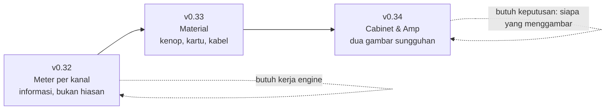

# P14–P16 — Meter per kanal, dan tampilan yang terasa seperti benda

*Direncanakan 1 Agu 2026, dari diskusi tentang apakah tiap blok perlu digambar seperti
pedal aslinya. Studi desainnya bisa dicoba di
<https://claude.ai/code/artifact/46899b68-e01a-46ef-bf68-8039d8ada223> — ada saklar untuk
membandingkan tampilan sekarang dengan usulannya langsung.*

## Keputusan yang mendasari seluruh rencana ini

**Material, bukan ilustrasi.**

Aturan yang tertulis di CLAUDE.md sejak awal: *menambah parameter berarti mengedit
`ChainFactory.cpp` dan tidak ada yang lain* — UI-nya dibangkitkan dari registry, jadi ia tidak
bisa hanyut dari engine. Menggambar tiap blok sebagai pedal membatalkan itu: mulai saat itu,
menambah blok berarti "edit `ChainFactory.cpp` **dan gambar sebuah pedal**". Pajak permanen,
dibayar satu orang, selamanya.

Dan satu blok membuatnya bukan sekadar mahal tapi mustahil: **Overdrive punya 12 voicing**, dan
`DRIVE_CONTROLS` mengganti nama kenopnya per voicing. Satu gambar pedal untuk blok itu berarti
kotak hijau bertuliskan "Overdrive" saat kamu memilih Big Muff — lebih buruk daripada abstrak,
karena ia mengklaim sesuatu yang tidak benar.

Polanya juga konsisten di luar sana: produk dengan **set efek terkurasi** (Logic Pedalboard,
Neural DSP) menggambar pedal; produk dengan **rantai bebas susun** (Axe-Edit, Helix Native)
tidak. Sejak v0.30/v0.31, MilodikFX jelas di kubu kedua.

Urutannya: yang **menambah informasi** duluan, yang menambah rasa menyusul, dan yang butuh aset
gambar paling akhir — karena itu satu-satunya yang tidak bisa saya selesaikan sendiri.

---

## v0.32.0 — "Meter per kanal" (P14)

**Tujuan:** meter input dan output menunjukkan L dan R terpisah.

### Kenapa sekarang, dan tidak sebelumnya

Sampai v0.27 ini akan sia-sia: semuanya mono dan digandakan, jadi dua bar selalu bergerak
identik. Tiga rilis mengubahnya — **pan per jalur** di Mixer (v0.28), **Cabinet mode stereo**
(v0.25), dan **mode split L/R** (v0.29). Kedua sisi sekarang benar-benar bisa berbeda.

Dan ada temuan dari membaca kodenya: `view.getMagnitude (0, samples)` adalah overload
**semua-kanal**, bukan kanal 0. Jadi meter yang ada sekarang menampilkan **sisi yang lebih
keras** dan menyembunyikan yang lebih pelan sepenuhnya. Itu bukan penyederhanaan yang dipilih;
itu informasi yang hilang tanpa ada yang menyebutnya.

**Input justru lebih berharga daripada output.** Dengan magnetik di port 1 dan piezo di port 2,
bar terpisah langsung memperlihatkan piezo jauh lebih panas — hal yang perlu diketahui sebelum
menyetel apa pun.

### P14-1. Engine

`LevelsHandler::updateLevels` menerima per-kanal. Payload `/api/levels` dan stream SSE bertambah
`inputLevelL/R`, `chainInputLevelL/R`, `outputLevelL/R`; field lama **tetap ada** dan tetap
berisi maksimum kedua kanal, jadi klien lama (dan `tests/smoke.ps1`) tidak pecah.

- `view.getMagnitude (ch, 0, samples)` per kanal, di titik yang sama seperti sekarang.
- **Aritmetika trim tetap berlaku per kanal**: `InputTrim` dual-mono dengan gain yang sama, jadi
  `inputDb + trimDb` benar untuk L dan R sendiri-sendiri. Tidak ada pengukuran kedua.
- **`modulationEngine.process` tetap memakai nilai gabungan.** Envelope follower yang tiba-tiba
  mengikuti satu kanal akan mengubah perilaku auto-wah setiap orang; ini bukan tempat untuk
  perubahan diam-diam.
- Plugin: `PluginProcessor` punya jalur metering sendiri dan ikut diubah.

**Test:** sinyal hanya-kiri melaporkan L jauh di atas R (dan simetris sebaliknya); field lama
sama dengan maksimum keduanya; trim menggeser keduanya sama banyak.

### P14-2. UI

`LevelMeter` menggambar dua bar tipis dengan tinggi total sama seperti satu bar tebal sekarang —
tidak ada ruang yang hilang. Penanda `L`/`R` di dalam bar, pembacaan `−8.4 / −14.1 dB`.

- **Ballistics-nya harus satu**: peak-hold dan laju jatuh dihitung dari komponen yang sama untuk
  kedua bar, atau dua sisi sinyal yang sama akan terlihat tidak sinkron.
- Perform view memakai meter yang sama dan **ikut mendapat manfaatnya** — di panggung, melihat
  satu sisi hilang itu justru paling berguna.

**Definition of done:** suite backend + frontend, E2E, smoke, pluginval, dokumentasi.
**Effort: ~1 weekend.**

---

## v0.33.0 — "Material" (P15)

**Tujuan:** kartu dan kenop terasa seperti benda, tanpa satu pun gambar per blok.

Semuanya komponen bersama: **26 efek ikut sekaligus, dan blok ke-27 tidak menagih pekerjaan
tambahan.** Itu ukuran keberhasilan rilis ini.

### P15-1. Kenop

Rasio dampak-per-kerja tertinggi di seluruh rencana. Interaksinya sudah benar sejak lama — drag
vertikal relatif, shift halus, roda, dobel-klik ke default, keyboard penuh. Yang belum ada cuma
materialnya:

- Cap dengan `radial-gradient` yang menangkap cahaya dari kiri-atas, cincin logam, bayangan jatuh.
- Garis penunjuk yang berputar, bukan hanya busur nilai.
- Busur nilai tetap ada di luar cincin, dengan warna aksen efeknya.

**Batas yang tidak boleh dilanggar:** `aria-disabled`, `tabindex`, `role="slider"` dan
`aria-valuetext` tetap persis seperti sekarang. Ini perubahan cat, bukan perubahan kontrol.

### P15-2. Kartu sebagai enclosure

Bevel setipis rambut di tepi atas, sekrup di sudut, tekstur halus, bayangan jatuh. Memakai
`EFFECT_ACCENTS` yang sudah ada; tidak ada aset baru.

### P15-3. Kabel, bukan garis

`ChainStrip` sudah menggambar router dua garis sejak v0.30. Mengganti garis lurus dengan kurva
SVG yang sedikit melengkung ke bawah membuatnya terbaca sebagai pedalboard, bukan diagram alir.

### Tiga hal yang harus dijaga, dan masing-masing punya alasan

- **Perform view tidak boleh mewarisi teksturnya.** Ia sengaja polos supaya terbaca dari dua
  meter di panggung dengan lampu buruk. Tapi ia **memakai `Knob` yang sama** — jadi kenopnya
  butuh varian polos, bukan sekadar berharap. Ini kendala nyata, bukan detail.
- **Kontras harus diukur, bukan dikira.** Tekstur menurunkan kontras. Angka nilai di dalam kenop
  dan label di kartu diperiksa terhadap latar barunya.
- **Jendela plugin bisa diubah ukurannya.** Semuanya gradient dan SVG, bukan raster, jadi ikut
  menskala. Ini alasan teknis untuk memilih CSS ketimbang gambar, bukan sekadar penghematan.

`prefers-reduced-motion` sudah dihormati dan tetap dihormati.

**Definition of done:** vitest untuk varian polos Perform, snapshot visual manual di WebView2
*dan* di jendela plugin, E2E, screenshot dokumentasi diperbarui.
**Effort: ~1.5 weekend.**

---

## v0.34.0 — "Cabinet & Amp" (P16)

**Tujuan:** dua blok yang benar-benar layak digambar, digambar.

Kisi speaker adalah **satu gambar** yang dikenali semua orang, **tidak berubah menurut parameter
apa pun**, dan cabinet-nya cuma satu tipe. Amp (NAM) juga tunggal. Keduanya kebalikan persis dari
Overdrive — dan justru karena itu mereka aman.

- Kisi kain untuk Cabinet, muka amp bertekstur untuk NAM.
- **Tanpa nama merek, logo, atau bentuk enclosure yang meniru produk tertentu.** Itu batas antara
  "terasa seperti gear" dan meniru barang orang lain, dan proyek ini tidak akan melewatinya.
- SVG atau CSS, bukan raster, supaya ikut menskala di jendela plugin.

### Yang harus diputuskan sebelum ini dimulai

**Siapa yang menggambar.** Saya bisa membuat CSS/SVG yang terbaca *sebagai* kisi speaker — itu
yang ada di studi desainnya sekarang. Saya **tidak** bisa membuat ilustrasi yang terlihat mahal.
Kalau hasil setingkat studi itu sudah cukup, ini satu weekend. Kalau kamu mau yang benar-benar
bagus, aset gambarnya perlu dibuat dengan alat gambar dan ini menunggu itu.

Ini satu-satunya rilis di rencana ini yang tidak bisa saya selesaikan sendirian, dan itu disebut
di muka daripada ditemukan di tengah jalan.

**Effort: ~1 weekend** (dengan aset setingkat studi), lebih lama kalau menunggu aset asli.

---

## Sengaja tidak dilakukan

| | Alasan |
|---|---|
| **Pedal per voicing** | 12 gambar untuk satu blok, ×3 instance, dan setiap voicing baru menagih lagi. Membatalkan "tambah parameter, edit satu file". |
| **View "Board" ketiga yang bergambar** | Sempat dipertimbangkan sebagai jalan tengah ala Logic. Ditunda: tiga view sudah cukup untuk satu orang, dan Edit yang bermaterial menutup sebagian besar keinginannya. |
| **Skeuomorfisme di Perform** | Ia ada justru karena tampilan padat tidak terbaca di panggung. Tekstur merusak alasan keberadaannya. |
| **Animasi kenop/jarum** | Meter sudah berjalan ~22 Hz; gerakan tambahan menaikkan biaya render tanpa menambah informasi. |

## Biaya, per bagian

| Bagian | Biaya sekali | Biaya per blok baru |
|---|---|---|
| Meter L/R | 1 komponen + 6 field | nol |
| Kenop material | 1 komponen | nol |
| Kartu enclosure | 1 stylesheet | nol |
| Kabel melengkung | 1 SVG | nol |
| Grille Cabinet & Amp | 2 gambar | nol |
| ~~Pedal per voicing~~ | ~~12 gambar~~ | ~~1 gambar, selamanya~~ |

**Total P14–P16: ±3.5 weekend**, tiga titik rilis. v0.32 berdiri sendiri dan berguna tanpa dua
yang lain; v0.34 adalah satu-satunya yang menunggu keputusan di luar kode.
