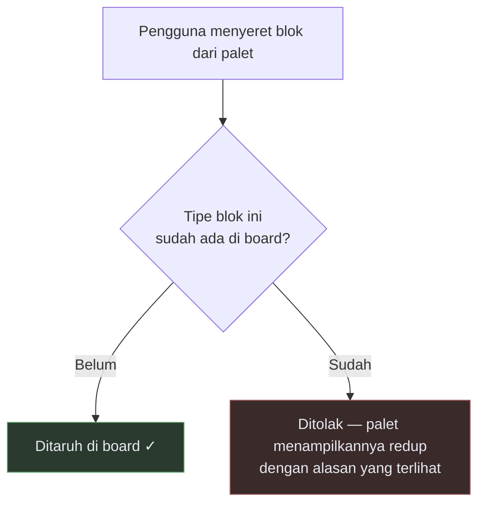
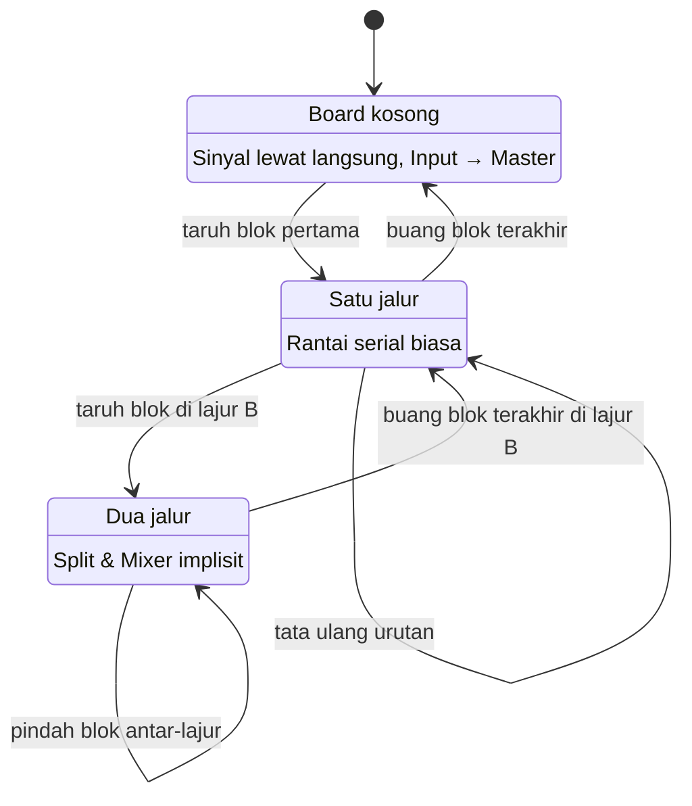
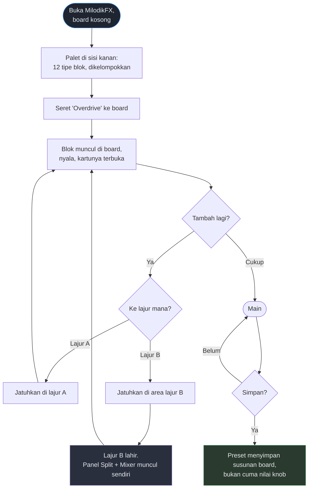
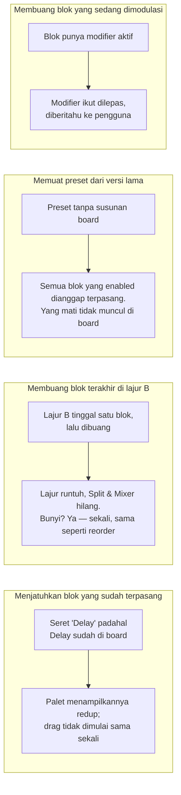
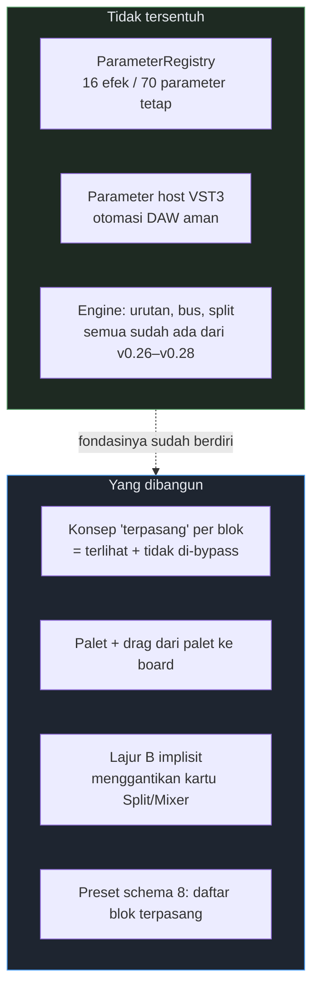

# Board kosong — alur pengguna

**Status:** rancangan untuk didiskusikan, belum diimplementasi.
**Tanggal:** 31 Juli 2026.

Dokumen ini merancang perubahan dari *rack tetap berisi 14 kartu* menjadi *board kosong yang diisi
sendiri*. Ditulis setelah membaca manual **Logic Pro Pedalboard** dan **Fractal FM9**, bukan dari
ingatan — dua temuan dari sana mengubah rancangannya, dan dicatat di bawah.

---

## 1. Apa yang dipelajari dari dua produk itu

### Logic Pro — Pedalboard

| Aspek | Perilaku |
|---|---|
| Menambah | Seret dari **Pedal Browser** ke posisi mana pun di Pedal area — kiri, kanan, atau **di antara** pedal yang sudah ada. Atau klik-ganda untuk menaruhnya di paling kanan |
| Mengganti | Seret pedal baru **tepat di atas** pedal lama |
| Menata ulang | Seret ke posisi baru. *"Automation and bus routings are moved with the effect pedal"* |
| Menghapus | Pilih, tekan Delete |
| Duplikat | **Tidak dibatasi** |
| Jalur kedua | **Bus B lahir ketika sebuah pedal dirutekan ke sana.** Mixer **muncul otomatis** saat bus kedua aktif, dan **hilang otomatis** saat semua pedal dihapus |

> **Temuan yang mengoreksi v0.28.** MilodikFX sekarang mewajibkan pengguna menaruh blok **Split** dan
> **Mixer** sendiri. Apple tidak: jalur kedua ada *karena* ada pedal di sana, dan bracket-nya implisit.
> Itu menghapus satu langkah yang tidak perlu ada.

### Fractal FM9

| Aspek | Perilaku |
|---|---|
| Grid | 14 kolom × 6 baris, banyak ruang sengaja kosong |
| Menyisipkan | NAV ke lokasi → putar VALUE menelusuri daftar blok → ENTER |
| Menghapus | Pilih → VALUE sampai "None" → ENTER, atau tombol DELETE |
| Ruang kosong | **Dilewati *shunt* pasif** — "no effect on the sound", berfungsi seperti kabel |
| Blok dihapus | **Digantikan shunt**, bukan lubang |

> **Temuan kedua.** Di Fractal, **grid kosong tidak berarti sinyal terputus** — ruang kosong dilalui
> kabel. Artinya "board kosong" bukan kondisi khusus yang perlu ditangani: ia hanya rantai yang semua
> bloknya belum dipasang, dan sinyalnya lewat begitu saja.

**Kesimpulan adaptasi:** ambil **model interaksi Pedalboard** (linear, seret dari palet, bracket
implisit) dan **model sinyal Fractal** (kosong = kabel lurus, bukan kasus khusus). Grid 2D penuh ala
Fractal tidak diambil — harganya id per-instance di seluruh lapisan penyimpanan.

---

## 2. Batas yang tidak bisa dilanggar

Satu hal membedakan MilodikFX dari keduanya, dan harus jujur ada di depan:

**Satu instance per tipe.** Penyebabnya dua lapis, keduanya nyata:

1. **Format VST3 mengunci daftar parameter saat plugin dimuat.** Parameter tidak boleh muncul dan
   hilang. Sekarang MilodikFX mengekspos 16 efek / 70 parameter yang tetap.
2. **`ParameterRegistry` tidak punya penghapusan**, dan `Binding` di plugin menyimpan pointer mentah
   ke dalam vektornya — aman *karena* registry tidak pernah berubah setelah konstruksi.

Konsekuensinya: **tidak bisa Tube Screamer di jalur A dan RAT di jalur B sekaligus.** Bisa: A pakai
Drive+EQ+Delay, B pakai Compressor+Contour+Reverb. Berbeda jauh — tapi tanpa kembar.

---

## 3. State board

**Aturan yang menentukan:** lajur B **tidak pernah dipasang** — ia muncul ketika ada blok di sana dan
runtuh ketika bloknya habis. Persis Mixer-nya Pedalboard. Blok Split dan Mixer yang sekarang terlihat
di rack **jadi tidak perlu ditampilkan sebagai kartu**; parameternya (mode crossover, frekuensi,
level, pan) pindah ke panel kecil di antara kedua lajur.

---

## 4. Alur utama: membangun rig dari nol

---

## 5. Kasus tepi yang harus diputuskan sekarang

Ini bagian yang biasanya baru ketahuan saat koding, dan mahal kalau salah:

**Empat keputusan yang saya sarankan:**

| Kasus | Keputusan | Alasan |
|---|---|---|
| Blok sudah terpasang | Palet meredupkannya, drag tidak dimulai | Menolak *sebelum* gestur lebih baik daripada menolak sesudahnya |
| Lajur B kosong | Runtuh otomatis, sekali bunyi | Sama seperti reorder — gestur mengedit, bukan manggung |
| Preset lama | `enabled` → terpasang, mati → tidak di board | Tanpa aturan ini, 10 preset bawaan jadi board penuh 14 blok |
| Blok bermodifier dibuang | Modifier ikut dilepas + diberitahu | Modifier menunjuk parameter lewat id; menyisakan yang menggantung akan menulis ke blok mati |

---

## 6. Yang berubah di kode, dan yang tidak

**Inti dari kenapa ini murah:** "terpasang" hanyalah **bypass + sembunyikan**. Bloknya tetap ada di
engine, tetap terdaftar, tetap punya parameter host. Yang berubah cuma apa yang digambar dan apakah
sinyal melewatinya.

Seluruh mesin beratnya — urutan atomik, penugasan bus, split/crossover — **sudah dikirim di v0.26
sampai v0.28.** Ini lapisan presentasi di atasnya.

**Perkiraan: ~1,5–2 weekend.**

---

## 7. Yang sengaja tidak diambil

| Dari | Fitur | Kenapa tidak |
|---|---|---|
| Fractal | Grid 2D 14×6 | Butuh id per-instance di seluruh persistensi; dan bahkan pengguna FM9 memperdebatkan seberapa sering dual-amp dipakai |
| Fractal & Logic | **Blok kembar** | Penghalang yang sama. Ini satu-satunya hal yang benar-benar hilang |
| Fractal | Shunt sebagai objek | Di MilodikFX ruang kosong memang sudah kabel — tidak perlu direpresentasikan |
| Logic | Klik-ganda untuk menaruh di kanan | Bisa ditambahkan belakangan; drag sudah menutupi kebutuhannya |

---

## 8. Pertanyaan yang masih terbuka

1. **Palet ditaruh di mana?** Sidebar kanan (menggeser panel yang ada) atau laci yang muncul saat
   dibutuhkan?
2. **Board kosong menampilkan apa?** Kabel lurus dengan ajakan, atau langsung palet terbuka?
3. **Apakah Perform view ikut berubah?** Kemungkinan tidak — ia menggambar scene dan knob tersemat,
   bukan board.
4. **Preset bawaan** — 10 preset yang ada perlu ditulis ulang dengan susunan board yang disengaja,
   bukan hasil konversi otomatis dari flag `enabled`.

---

## Sumber

- [Use the Pedalboard Pedal area — Apple](https://support.apple.com/guide/logicpro/use-the-pedal-area-lgcef14a23d1/mac)
- [Use the Pedalboard Browser — Apple](https://support.apple.com/guide/logicpro/use-the-pedal-browser-lgcef14a2e5e/mac)
- [Use the Pedalboard Router — Apple](https://support.apple.com/guide/logicpro/use-the-router-lgcef14a2004/mac)
- [Pedalboard (manual Logic 9.1.6) — Apple](https://help.apple.com/logicpro/mac/9.1.6/en/logicpro/effects/chapter_1_section_4.html)
- [FM9 Owner's Manual — Layout Grid & Working With Blocks](https://www.manualslib.com/manual/2228744/Fractal-Fm9.html?page=46)
- [FM9 Owner's Manual — Intro To The Layout Grid](https://www.manualslib.com/manual/2228744/Fractal-Fm9.html?page=20)
- [FM9 Owner's Manual (PDF resmi)](https://www.fractalaudio.com/downloads/manuals/FM9/FM9-Owners-Manual.pdf)
